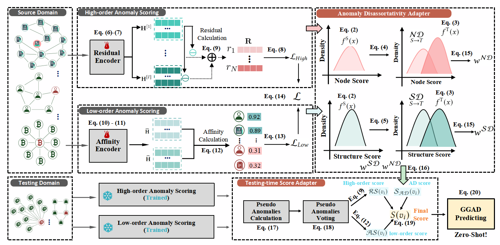

# TA-GGAD: Testing-time Adaptive Graph Model for Generalist Graph Anomaly Detection

This repository is the source codes implementation of "TA-GGAD: Testing-time Adaptive Graph Model for Generalist Graph Anomaly Detection"



# running environment
* python 3.8.14
* torch 1.13.1+cu117
* dgl 0.9.1+cu117


# Usage
```
python train_TA_GGAD.py
```

